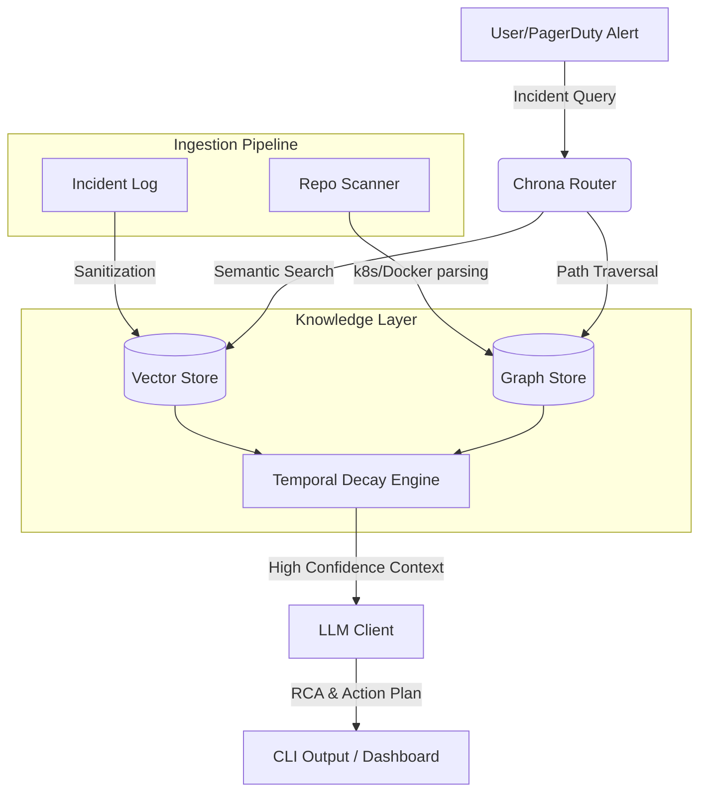

# Chrona ⏳

> **An incident memory and RCA reasoning tool.**

📺 **[Watch the 2-Minute Demo Video Here](https://youtube.com/your-video-link)**

Chrona bridges the gap between historical operations data and real-time LLM reasoning. By building a temporal, graph-based index of your infrastructure, it prevents AI agents from making "stale" recommendations based on deprecated architectures and instantly surfaces the causal dependencies behind incidents.

## 🌟 Why Chrona?

Current GenAI DevOps agents often suffer from **Temporal Hallucination**. 
If your database migrated from standalone to cluster 3 months ago, a standard RAG system might still pull up a 6-month-old runbook and suggest deprecated configurations, causing further downtime during a critical incident.

**Chrona solves this by implementing:**
1. **Repository-Aware Infrastructure Graphs:** Automatically builds a dependency graph directly from your Kubernetes and Docker manifests.
2. **Temporal Decay Engine:** Algorithmically decays the confidence score of historical incident memories based on how much the underlying infrastructure has changed since the memory was formed.
3. **Hybrid Retrieval:** Queries aren't just semantic. Chrona traverses the causal infrastructure graph to find related dependencies.
4. **Agentic LLM RCA:** Pipes the sanitized, temporally-weighted context into a fast LLM (like Llama 3 via Groq) to generate Root Cause Analysis (RCA).

## 🏗 Architecture



## ⚙️ Environment Setup (`.env`)

Before running Chrona, you need to set up your `.env` file. Create a `.env` file in the root directory:

```env
# Hindsight Platform (For remote tracing & logging)
HINDSIGHT_API_KEY=hsk_d509...
HINDSIGHT_PROJECT_ID=chrona5566
HINDSIGHT_BASE_URL=https://api.hindsight.vectorize.io

# Storage & Database Provider
CHRONA_STORAGE_MODE=local
CHRONA_DATA_DIR=./data
VECTOR_STORE_PROVIDER=local

# LLM Keys & Connections (Set whichever is applicable)
GROQ_API_KEY=gsk_your_groq_api_key
OPENAI_API_KEY=
ANTHROPIC_API_KEY=
OLLAMA_BASE_URL=http://localhost:11434

# Cascadeflow Router Settings
CASCADEFLOW_ENABLED=true
CASCADEFLOW_DEFAULT_MODEL=qwen/qwen3-32b
CASCADEFLOW_FALLBACK_MODEL=openai/gpt-oss-120b

# Security & Runtime Limits
CHRONA_ENABLE_SANITIZATION=true
CHRONA_MASK_SECRETS=true
CHRONA_MAX_CONTEXT_TOKENS=12000
CHRONA_MAX_FILE_SIZE_MB=5
CHRONA_ENABLE_AUDIT_LOGS=true
CHRONA_DISABLE_RAW_LOG_EXPORT=true
CHRONA_DEBUG=true
```

## 🚀 Quickstart

### Option A: Docker (Recommended)
You can build and run Chrona entirely in Docker without installing any Python dependencies locally.

1. **Build the image:**
```bash
docker build -t chrona .
```

2. **Run Chrona on your own repository:**
Mount your local repository into the Docker container to scan it. Replace `<path-to-your-repo>` with the absolute path to the codebase you want to scan.
```bash
docker run -it --env-file .env -v "<path-to-your-repo>:/workspace/target-repo" chrona scan /workspace/target-repo
```

3. **Ask an incident query:**
```bash
docker run -it --env-file .env -v "<path-to-your-repo>:/workspace/target-repo" chrona ask "database connection timeout"
```

### Option B: Local Python Install
If you prefer running it locally via Python 3.10+:

1. **Install Dependencies:**
```bash
pip install -r requirements.txt
```

2. **Scan your repository:**
Point Chrona to your target repository folder.
```bash
python -m chrona.cli.commands scan <path-to-your-repo>
```

3. **Ask for RCA:**
Query a live incident to get graph-backed, temporally-scored Root Cause Analysis.
```bash
python -m chrona.cli.commands ask "API gateway is returning 502 bad gateway"
```

## 🛠 Core Commands

**1. Scan an Infrastructure Repository**
Builds the dynamic infrastructure graph from code. Look for `docker-compose.yml`, `package.json`, `requirements.txt`, and Kubernetes `.yaml` manifests.
```bash
python -m chrona.cli.commands scan ../<your-repo-name>
```

**2. Ask for RCA**
Ask Chrona to find the root cause of an issue based on the graph it just built and historical incidents.
```bash
python -m chrona.cli.commands ask "checkout latency spike after deployment"
```

**3. Visualize Dependency Path**
If Chrona detects a path between two services, you can render an interactive HTML graph.
```bash
python -m chrona.cli.commands graph-path <source-service> <target-service> --visualize
```

**4. Run the Demo**
Want to see how it works instantly? Point it at a test repo like Google's Microservices Demo.
```bash
python -m chrona.cli.commands demo --repo-path ../microservices-demo
```

## 🔒 Security & Privacy

Chrona includes a **Sanitization Pipeline** that automatically redacts secrets, PII, and credentials from raw incident logs before they ever hit the Vector Store or LLM.

## ⚠️ Current Limitations (MVP)

As an MVP prototype, Chrona currently has the following known boundaries:

1. **API Rate Limits:** The default setup uses Groq's free API tier. If you run the `demo` or `ask` commands too rapidly, you may hit the `429 Too Many Requests` rate limit. Wait a minute and try again.
2. **Repository Size Constraints:** The tool works best on microservice architectures under 10,000 files. Very large monorepos may cause the AST parser to hit the local memory limit or graph serialization limit.
3. **Supported Architectures:** The current `RepoScanner` natively parses Docker Compose (`docker-compose.yml`), Kubernetes manifests (`.yaml`), NPM (`package.json`), and Python (`requirements.txt`). Other frameworks (like Terraform, Go modules, or raw Maven) are not currently mapped into the graph.
4. **Context Window:** If a query pulls in too many related incidents, the prompt may exceed the 8k/32k token limits of the selected LLM, causing a fallback response.

## 💡 Built With
- **NetworkX & PyVis:** For complex graph manipulation and interactive rendering.
- **Groq & Llama 3.3:** For fast RCA reasoning.
- **Rich & Typer:** For the CLI interface.
