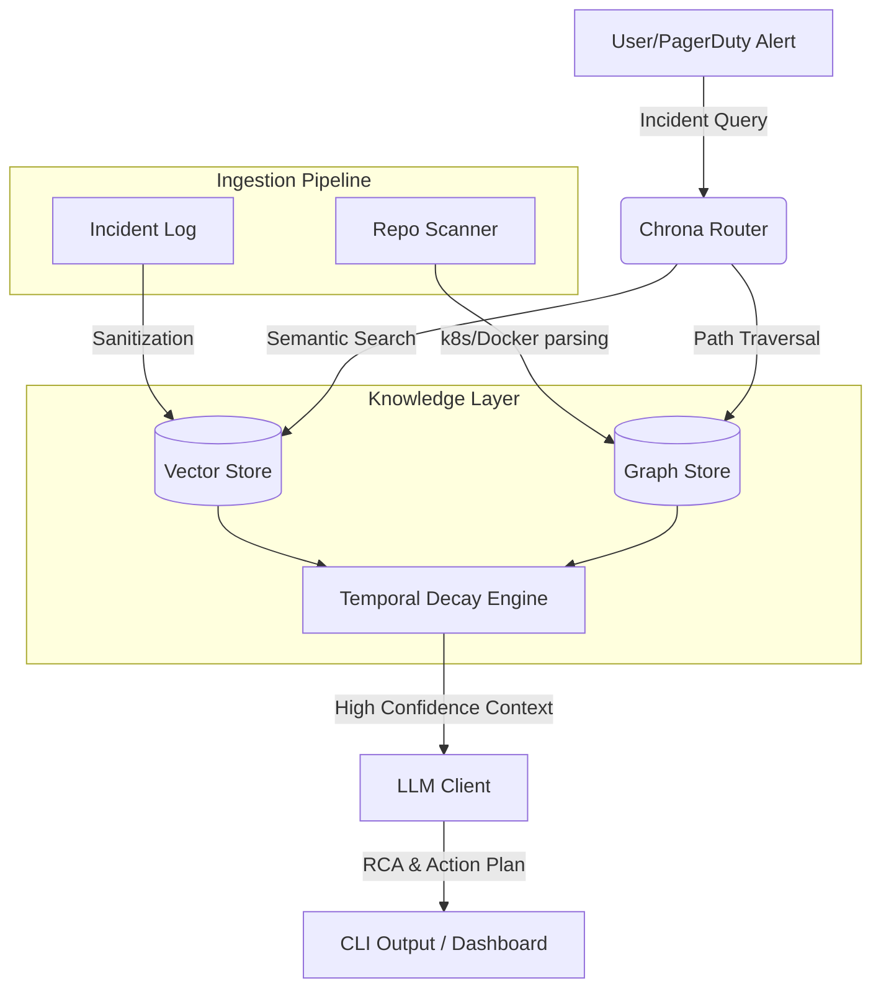

# Chrona ⏳

> **An Incident Memory and Root Cause Analysis (RCA) Reasoning Tool.**

📺 **[Watch the 2-Minute Demo Video Here](https://youtube.com/your-video-link)**

Chrona bridges the gap between historical operations data and real-time LLM reasoning. By building a temporal, graph-based index of your infrastructure, it prevents AI agents from making "stale" recommendations based on deprecated architectures and instantly surfaces the causal dependencies behind active incidents.

---

## 🌟 Why Chrona?

Current GenAI SRE/DevOps agents suffer heavily from **Temporal Hallucination**. 
If your database migrated from standalone to a cluster 3 months ago, a standard RAG system might still pull up a 6-month-old runbook and suggest deprecated configurations, causing further downtime during a critical incident.

**Chrona solves this by implementing:**
1. **Repository-Aware Infrastructure Graphs:** Automatically maps dependency topologies directly from your Kubernetes manifests and Docker Compose configurations using safe AST-aware loaders.

2. **Temporal Decay Engine:** Algorithmically decays the confidence score of historical incident memories based on how much the underlying infrastructure has changed since the incident occurred.

3. **Triple-Tier Hybrid Vector Store:** Pluggable semantic retrieval. Leverages OpenAI Cloud Embeddings, local `sentence-transformers` models, or a zero-dependency local TF-IDF backup.

4. **Dynamic Cascadeflow Router:** Uses a weighted heuristic decision engine (evaluating severity, task complexity, confidence, and tokens) with built-in API cost estimators.

5. **Zero-Dependency High-Fidelity Simulation:** Built-in offline SRE heuristic simulation that generates realistic root cause analyses even if API keys are missing.

---

## 🏗 Architecture



---

## 🛠️ Tech Stack

* **Core Runtime:** Python 3.10+ (Scalable, typed asynchronous logic)

* **Graph Processing:** NetworkX (Topology mapping & shortest path traversals)

* **Semantic Search:** Scikit-Learn (Local TF-IDF) & OpenAI Cloud Embeddings

* **Graph Visualizations:** PyVis (Interactive physics-based HTML networks)

* **Model Validation:** Pydantic v2 (Strict data schemas & settings)

* **CLI Experience:** Typer & Rich (Visual, production-grade SRE terminals)

---

## 📂 Project Structure

```text
chrona/
├── data/               # Graph database and cached incident memories
│
├── src/chrona/         # Main application source
│   ├── cli/            # Rich-Typer SRE terminal commands
│   ├── config/         # System settings and global environment configuration
│   ├── graph/          # NetworkX building and interactive visual generators
│   ├── intelligence/   # Local simulators, confidence scorers, and log sanitizers
│   ├── llm/            # Generative API clients and keyless heuristic engines
│   ├── memory/         # Vector stores and remote telemetry collectors
│   ├── retrieval/      # Hybrid retrieval flow and graph path traversers
│   ├── routing/        # Cascadeflow dynamic heuristic model routing
│   ├── schemas/        # Pydantic validation contracts
│   └── services/       # Core orchestrators and replay services
│
└── tests/              # 12-suite pytest coverage framework
```

---

## 🚀 Instant Setup & Zero-Key Demo (Under 1 Minute!)

You do **not** need an API key to experience Chrona's full capabilities! If no keys are configured, the CLI will automatically activate its **High-Fidelity Local Simulation Engine** to show a highly realistic offline interactive demo.

### 🐳 Option A: Docker (Recommended)
You can run Chrona entirely inside a Docker container without installing any local Python dependencies.

1. **Build the Docker Image:**
   ```bash
   docker build -t chrona .
   ```

2. **Run the Interactive Demo:**
   ```bash
   docker run -it chrona demo
   ```

3. **Ask custom incident queries:**
   ```bash
   docker run -it chrona ask "redis connection pool timeout in checkoutservice"
   ```

---

### 🐍 Option B: Local Python Installation
If you prefer running Chrona directly on your host machine:

1. **Clone and Install Dependencies:**
   ```bash
   # Create and activate a virtualenv (optional but recommended)
   python -m venv .venv
   source .venv/bin/activate  # On Windows: .venv\Scripts\activate
   
   # Install dependencies
   pip install -e .
   ```

2. **Run the Interactive Demo:**
   ```bash
   python -m chrona.cli.commands demo
   ```

3. **Ask custom incident queries:**
   ```bash
   python -m chrona.cli.commands ask "checkout payment gateway timeout"
   ```

---

## ⚙️ Environment Setup

To connect Chrona to live generative LLMs (like Groq or OpenAI) and enable cloud tracing, create a `.env` file in the project root by copying the provided template:

```bash
# Copy the example environment template
cp .env.example .env
```

* **LLM Integration:** Set your `GROQ_API_KEY` (for fast Llama-based reasoning) or `OPENAI_API_KEY` (for cloud embeddings). All settings are pre-configured to run out-of-the-box!

* **Cloud Telemetry (Optional):** To enable remote SRE tracing and logging on the Hindsight platform, populate the `HINDSIGHT_API_KEY`, `HINDSIGHT_PROJECT_ID`, and `HINDSIGHT_BASE_URL` fields inside `.env`.

To run with your `.env` file in Docker:
```bash
docker run -it --env-file .env -v "$(pwd):/workspace" chrona demo
```

---

## 🛠️ Complete CLI Command Reference

All CLI commands follow this standard, high-level invocation pattern:

* **Local Structure:** `python -m chrona.cli.commands <command> [arguments] [options]`
* **Docker Structure:** `docker run -it [--env-file .env] chrona <command> [arguments] [options]`

---

### 1. Scan a Target Codebase
Scan any target folder to parse Kubernetes configurations, compose files, and dependency manifests to construct the infrastructure topology.

* **General Structure:**
  ```bash
  python -m chrona.cli.commands scan <path-to-target-directory>
  ```

* **Concrete Example:**
  ```bash
  python -m chrona.cli.commands scan ./my-microservice-repo
  ```

---

### 2. Analyze an Active Incident
Query the dynamic topology graph, search previous incident histories, calculate decay penalties, and output an SRE Root Cause Analysis.

* **General Structure:**
  ```bash
  python -m chrona.cli.commands ask "<incident-description>"
  ```

* **Concrete Example:**
  ```bash
  python -m chrona.cli.commands ask "redis connection pool timeout in checkoutservice"
  ```

---

### 3. Visualize a Dependency Path
Traverse the causal dependency topology between two active nodes and compile a physics-based, dynamic visual NetworkX graph locally.

* **General Structure:**
  ```bash
  python -m chrona.cli.commands graph-path <source-service> <target-service> --visualize
  ```

* **Concrete Example:**
  ```bash
  python -m chrona.cli.commands graph-path service:checkoutservice service:redis-cart --visualize
  ```

---

### 4. Inspect Model Routing Statistics
Display full auditing and diagnostic logs detailing Cascadeflow router tier performance, total token workloads, and dynamic API cost savings.

* **General Structure:**
  ```bash
  python -m chrona.cli.commands route-stats
  ```

* **Concrete Example:**
  ```bash
  python -m chrona.cli.commands route-stats
  ```

---

## 🧪 Running the Unit Tests

Chrona is backed by a robust test suite covering graph builder logic, service mappings, temporal decay algorithms, and secrets sanitizers.

To install dev dependencies and run the tests:
```bash
# Install test requirements
pip install pytest pytest-cov

# Run the test suite
python -m pytest
```

---

## 🔒 Security & Privacy (PII Masking)

Chrona integrates a strict SRE **Sanitization Pipeline**. Raw server logs, console tracebacks, and database records are fully sanitized of any credentials, email addresses, IP coordinates, and API keys before they hit local indexes or upstream generative models.

## 💡 Built With
* **NetworkX & PyVis:** For dependency mapping, shortest path traversals, and physics-based network rendering.
* **Scikit-Learn:** For local TF-IDF semantic indexes.
* **Groq & Llama 3.3:** For lightning-fast generative RCA reasoning.
* **Rich & Typer:** For a gorgeous, highly visual CLI terminal experience.

---

## ⚠️ Scope Boundaries & Operational Limits

As a high-performance prototype, Chrona operates under a few engineering boundaries to be aware of:

1. **API Rate Limiting (Groq Free Tier):** The default config runs on Groq's free versatile tier. If commands are invoked rapidly in succession, you may trigger standard `429 Too Many Requests` limits. Wait 60 seconds or switch to an OpenAI key inside `.env` to bypass this.

2. **Repository Scale Constraints:** Chrona's repository AST scanner is optimized for microservice architectures under **10,000 files**. Parsing monorepos exceeding this scale may cause high local CPU spikes or NetworkX memory limits.

3. **Supported Architectures:** The dependency extractor natively parses Kubernetes manifests (`.yaml`), Docker Compose (`docker-compose.yml`), Python (`requirements.txt`), and Node.js (`package.json`). Frameworks like Terraform, Go, or Java modules are currently outside the ingestion parser scope.

4. **LLM Context Boundaries:** Extremely large historic incidents can exhaust the context window limits of standard models, triggering fallback responses. Keep incident logs truncated below 12k tokens.
